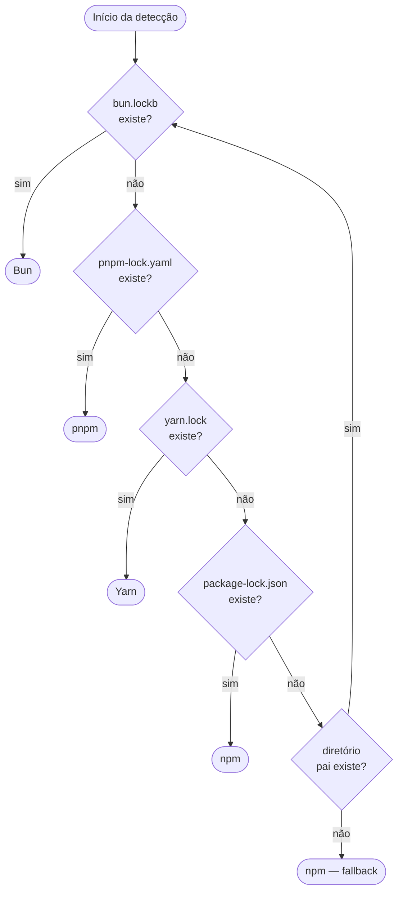
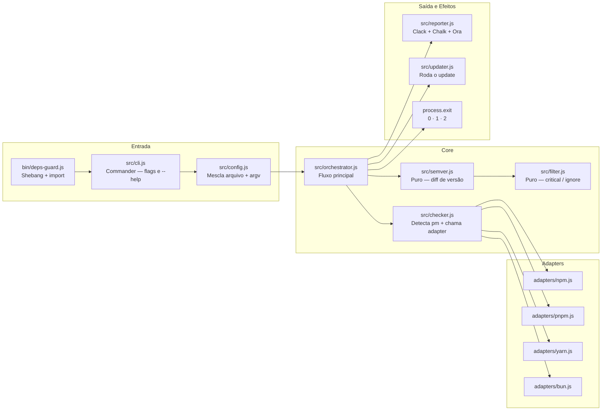
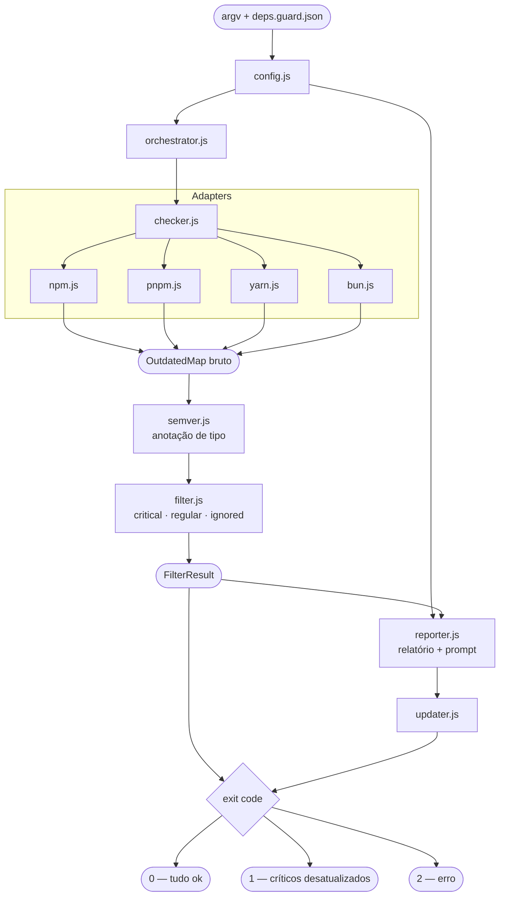

# deps-guard

> Bloqueie dependências desatualizadas antes que elas rodem no seu projeto.

`deps-guard` é uma ferramenta de CLI projetada para rodar como um hook `pre*` do npm. Ela verifica se suas dependências estão atualizadas — opcionalmente bloqueando a execução quando pacotes críticos ficam para trás — e oferece interativamente atualizá-las na hora.

```bash
npx deps-guard --critical react,next,typescript --ignore zod
```

---

## Índice

- [Por que usar](#por-que-usar)
- [Instalação](#instalação)
- [Uso](#uso)
  - [Como hook pre-script](#como-hook-pre-script)
  - [Arquivo de configuração](#arquivo-de-configuração)
  - [Flags da CLI](#flags-da-cli)
  - [Modo CI](#modo-ci)
- [Exit codes](#exit-codes)
- [Suporte a package managers](#suporte-a-package-managers)
- [Decisões de UX](#decisões-de-ux)
- [Arquitetura](#arquitetura)
  - [Estrutura de arquivos](#estrutura-de-arquivos)
  - [Responsabilidades dos módulos](#responsabilidades-dos-módulos)
  - [Fluxo de dados](#fluxo-de-dados)
- [Contribuindo](#contribuindo)

---

## Por que usar

Você já roda linters, checagem de tipos e testes antes de fazer deploy. Mas nada te avisa quando você está desenvolvendo com uma versão desatualizada do React, Next.js ou do seu próprio design system.

O `deps-guard` preenche essa lacuna. Adicione-o em um hook `predev` ou `prebuild` e ele vai:

1. Detectar seu package manager automaticamente
2. Verificar dependências desatualizadas
3. Exibir um relatório claro agrupado por severidade (major / minor / patch)
4. Em sessões interativas, oferecer atualizar na hora
5. Sair com o exit code correto para que seu script continue ou seja abortado

Nenhuma configuração necessária para começar. Controle total quando você quiser.

---

## Instalação

```bash
# npm
npm install --save-dev deps-guard

# pnpm
pnpm add -D deps-guard

# yarn
yarn add -D deps-guard

# bun
bun add -d deps-guard
```

---

## Uso

### Como hook pre-script

Adicione o `deps-guard` como script `pre*` no seu `package.json`. npm, pnpm, yarn e bun executam hooks `pre*` automaticamente antes do script correspondente.

```json
{
  "scripts": {
    "predev": "deps-guard --critical react,next,typescript --ignore zod",
    "dev": "next dev",

    "prebuild": "deps-guard --ci",
    "build": "next build"
  }
}
```

Quando o `deps-guard` sai com código `1` (dependências críticas desatualizadas), o package manager aborta a execução e `dev` / `build` nunca roda.

### Arquivo de configuração

Em vez de (ou além de) flags de CLI, crie um `deps.guard.json` na raiz do seu projeto:

```json
{
  "critical": ["react", "react-dom", "next", "typescript"],
  "ignore": ["zod", "eslint"],
  "failOn": "critical"
}
```

Flags de CLI têm precedência sobre o arquivo de configuração, então você pode sobrescrever por execução sem editar o arquivo.

**Todas as opções de configuração:**

| Chave        | Tipo                                 | Padrão       | Descrição                                                |
| ------------ | ------------------------------------ | ------------ | -------------------------------------------------------- |
| `critical`   | `string[]`                           | `[]`         | Pacotes que disparam exit code `1` quando desatualizados |
| `ignore`     | `string[]`                           | `[]`         | Pacotes ignorados silenciosamente no relatório           |
| `failOn`     | `"critical"` \| `"any"` \| `"never"` | `"critical"` | Quando sair com código `1`                               |
| `updateType` | `"major"` \| `"minor"` \| `"patch"`  | `"major"`    | Tipo mínimo de atualização a reportar                    |

### Flags da CLI

| Flag                   | Alias | Descrição                                                                     |
| ---------------------- | ----- | ----------------------------------------------------------------------------- |
| `--critical <pkgs>`    | `-c`  | Lista separada por vírgulas de pacotes críticos                               |
| `--ignore <pkgs>`      | `-i`  | Lista separada por vírgulas de pacotes a ignorar                              |
| `--fail-on <level>`    |       | `critical` (padrão), `any` ou `never`                                         |
| `--update-type <type>` |       | Tipo mínimo a reportar: `major`, `minor`, `patch`                             |
| `--ci`                 |       | Modo não-interativo, sem prompts (detectado automaticamente via env var `CI`) |
| `--json`               |       | Imprime o relatório como JSON no stdout                                       |
| `--no-update`          |       | Pula o prompt interativo de atualização                                       |
| `--version`            | `-v`  | Exibe a versão                                                                |
| `--help`               | `-h`  | Exibe a ajuda                                                                 |

### Modo CI

Em ambientes de CI, prompts interativos são desativados automaticamente quando a variável de ambiente `CI` está definida (padrão no GitHub Actions, CircleCI, Vercel, etc.). Você também pode forçar explicitamente:

```bash
deps-guard --ci
```

No modo CI, o `deps-guard` imprime o relatório e sai com o código apropriado. Nunca faz prompts e nunca roda atualizações.

---

## Exit codes

Exit codes são o que faz o `deps-guard` funcionar como hook `pre*`. O package manager verifica o exit code após cada pre-script — um código diferente de zero aborta o pipeline.

| Código | Significado                                                                            |
| ------ | -------------------------------------------------------------------------------------- |
| `0`    | Todas as dependências estão atualizadas (ou nenhuma atinge o limite de reporte)        |
| `1`    | Um ou mais pacotes críticos estão desatualizados — pipeline bloqueado                  |
| `2`    | Erro inesperado (`node_modules` ausente, falha de rede, package manager não suportado) |

Você controla o que dispara o código `1` via `--fail-on`:

- `critical` (padrão) — apenas pacotes listados em `--critical` / `config.critical`
- `any` — qualquer pacote desatualizado causa falha
- `never` — sempre sai com `0`, útil para apenas gerar relatórios

---

## Suporte a package managers

O `deps-guard` detecta seu package manager automaticamente procurando por arquivos de lock nesta ordem:



A detecção percorre a árvore de diretórios a partir do `cwd`, então projetos monorepo com um lock file na raiz são tratados corretamente.

Cada package manager tem seu próprio adapter com o comando e formato de saída corretos:

| Manager | Comando utilizado                |
| ------- | -------------------------------- |
| npm     | `npm outdated --json`            |
| pnpm    | `pnpm -r outdated --format json` |
| yarn    | `yarn outdated --json`           |
| bun     | `bun outdated`                   |

---

## Decisões de UX

UX é uma preocupação de primeira classe no `deps-guard`. Abaixo está o raciocínio por trás de cada escolha.

### Commander para flags, Clack para o prompt interativo

[Commander.js](https://github.com/tj/commander.js) cuida do parsing de flags (`--critical`, `--ci`, `--json`). Ele produz saída padrão de `--help` e lida com casos de borda como valores ausentes, flags desconhecidas e exibição de versão.

[Clack](https://github.com/natemoo-re/clack) cuida da sessão interativa — o prompt "o que você deseja fazer?" após o relatório. A estética do Clack (spinner, saída agrupada, seleções estilizadas) combina com a personalidade da ferramenta sem precisar construir um TUI do zero.

Os dois são complementares: Commander é dono do contrato (quais flags existem e o que significam), Clack é dono da experiência (como a sessão parece e se sente em um terminal interativo).

### Chalk para cores, não ANSI bruto

O script original usava códigos de escape ANSI brutos (`\x1b[31m`). Isso funciona na maioria dos terminais, mas quebra em alguns (notavelmente alguns terminais Windows e certos renderers de log de CI que removem sequências desconhecidas).

[Chalk](https://github.com/chalk/chalk) detecta capacidades do terminal e aplica as variáveis de ambiente `NO_COLOR` e `FORCE_COLOR` automaticamente. Ele também lida com a convenção de flags `--color` / `--no-color`. O comportamento é o mesmo; a superfície de compatibilidade é muito maior.

### Ora para o spinner de carregamento

Rodar `outdated` pode levar de 2 a 10 segundos em um monorepo grande. Sem feedback, usuários assumem que o processo travou. [Ora](https://github.com/sindresorhus/ora) adiciona um spinner com uma mensagem de status de uma linha durante a verificação. Ele limpa adequadamente quando a verificação termina, deixando apenas o relatório.

### Agrupamento por severidade

O relatório organiza pacotes desatualizados em três níveis de severidade: **MAJOR**, **MINOR** e **PATCH**. Pacotes críticos (da sua configuração) sempre aparecem primeiro, independentemente do nível.

Isso espelha como os desenvolvedores realmente triagem: bumps major precisam de um plano de migração, bumps minor precisam de testes, bumps patch geralmente são seguros de aplicar imediatamente. Mostrar tudo em uma lista plana esconde esse sinal.

### Modo não-interativo é automático

Definir `CI=true` (padrão em todos os principais provedores de CI) desativa automaticamente os prompts e faz o `deps-guard` se comportar como uma ferramenta pura de verificação e saída. Nenhuma configuração especial é necessária para pipelines de CI.

### Saída JSON para tooling

`--json` imprime um relatório legível por máquina no stdout, tornando o `deps-guard` combinável com outros scripts, dashboards ou pipelines de notificação:

```json
{
  "outdated": 5,
  "critical": ["react", "next"],
  "packages": {
    "react": { "current": "18.2.0", "latest": "19.1.0", "type": "major" },
    "next": { "current": "14.0.0", "latest": "15.2.0", "type": "major" },
    "zod": { "current": "3.20.0", "latest": "3.23.0", "type": "ignored" }
  }
}
```

---

## Arquitetura

### Estrutura de arquivos

```
deps-guard/
├── bin/
│   └── deps-guard.js          # Entry point com shebang, chama src/cli.js
├── src/
│   ├── cli.js                 # Setup do Commander, parsing de flags, chama orchestrator
│   ├── config.js              # Mescla deps.guard.json com argv em um objeto de config
│   ├── orchestrator.js        # Coordena o fluxo: check → filter → report → update
│   ├── checker.js             # Detecta o package manager, delega ao adapter correto
│   ├── semver.js              # Puro: compara versões, retorna major/minor/patch/none
│   ├── filter.js              # Puro: aplica regras de critical/ignore, retorna resultado estruturado
│   ├── reporter.js            # Toda a saída no terminal: Clack, Chalk, Ora — sem lógica aqui
│   ├── updater.js             # Executa o comando de atualização do package manager detectado
│   └── adapters/
│       ├── npm.js             # npm outdated --json → saída normalizada
│       ├── pnpm.js            # pnpm -r outdated --format json → saída normalizada
│       ├── yarn.js            # yarn outdated --json → saída normalizada
│       └── bun.js             # bun outdated → saída normalizada
├── deps.guard.json            # Config de exemplo (também usado por este próprio repo)
└── package.json
```

### Responsabilidades dos módulos



**`bin/deps-guard.js`** — Entry point registrado em `package.json#bin`. Contém apenas o shebang e um import dinâmico de `src/cli.js`. Mantido mínimo para que o código real seja importável por outras ferramentas sem o shebang.

**`src/cli.js`** — Dono do contrato da CLI. Usa Commander para definir todas as flags, seus tipos e padrões. Lê `deps.guard.json` via `config.js`, mescla com o argv parseado (argv vence) e então chama `orchestrator.js`.

**`src/config.js`** — Resolve o objeto de configuração final. Percorre a árvore de diretórios a partir do `cwd` para encontrar o `deps.guard.json`, faz parse e validação, e então mescla com as flags da CLI.

**`src/orchestrator.js`** — O fluxo principal. Chama `checker.js`, passa os dados brutos por `semver.js` e `filter.js`, entrega o resultado estruturado para `reporter.js`, opcionalmente chama `updater.js` e finalmente chama `process.exit()` com o código correto. É o único módulo que chama `process.exit()`.

**`src/checker.js`** — Detecta o package manager (detecção de lock file, percorrendo a árvore), instancia o adapter correto e retorna dados normalizados. Formato normalizado:

```ts
type OutdatedMap = Record<
  string,
  {
    current: string;
    wanted: string;
    latest: string;
  }
>;
```

**`src/semver.js`** — Apenas funções puras. Sem I/O, sem efeitos colaterais. Recebe duas strings de versão e retorna `"major" | "minor" | "patch" | "none"`. Testável independentemente.

**`src/filter.js`** — Apenas funções puras. Recebe o `OutdatedMap` normalizado e a configuração, retorna:

```ts
type FilterResult = {
  critical: string[]; // pacotes desatualizados em config.critical
  regular: string[]; // pacotes desatualizados que não são critical nem ignored
  ignored: string[]; // pacotes ignorados conforme config.ignore
  data: OutdatedMap;
};
```

**`src/reporter.js`** — Toda a saída no terminal fica aqui. Recebe um `FilterResult` e a configuração, usa Chalk e Clack para renderizar o relatório e o prompt interativo. Retorna a escolha do usuário (`"critical" | "all" | "ignore" | null`). Sem lógica de negócio — apenas apresenta e pergunta.

**`src/updater.js`** — Recebe uma lista de nomes de pacotes e o package manager detectado, constrói e roda o comando de atualização. Retorna um booleano indicando sucesso.

**`src/adapters/*.js`** — Cada adapter exporta uma única função assíncrona:

```ts
async function getOutdated(cwd: string): Promise<OutdatedMap>;
```

O adapter roda o comando de outdated do package manager, faz parse da saída (que varia de formato por manager) e retorna o `OutdatedMap` normalizado. Todas as peculiaridades de parsing específicas do adapter ficam isoladas aqui.

### Fluxo de dados



### Por que os módulos puros importam

`semver.js` e `filter.js` são mantidos estritamente puros (sem I/O, sem efeitos colaterais) para que possam ser testados unitariamente sem mockar o sistema de arquivos ou spawnar processos. O restante da complexidade — execução de comandos, saída no terminal, interação com usuário — fica isolado em módulos mais fáceis de testar por integração ou manualmente.

Essa fronteira também significa que, se um novo package manager precisar ser suportado, apenas um novo arquivo de adapter é necessário. A lógica central não muda.

---

## Contribuindo

```bash
git clone https://github.com/você/deps-guard
cd deps-guard
pnpm install
node bin/deps-guard.js --help
```

Para testar em um projeto real, use `pnpm link` (ou `npm link`) neste repositório e depois `pnpm link deps-guard` no projeto alvo.

Os testes ficam em `test/` e focam nos módulos puros (`semver`, `filter`) e na normalização de saída dos adapters. Sessões interativas são testadas manualmente.

```bash
pnpm test
```
