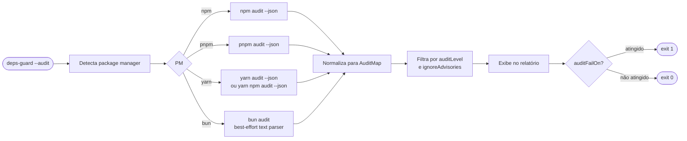
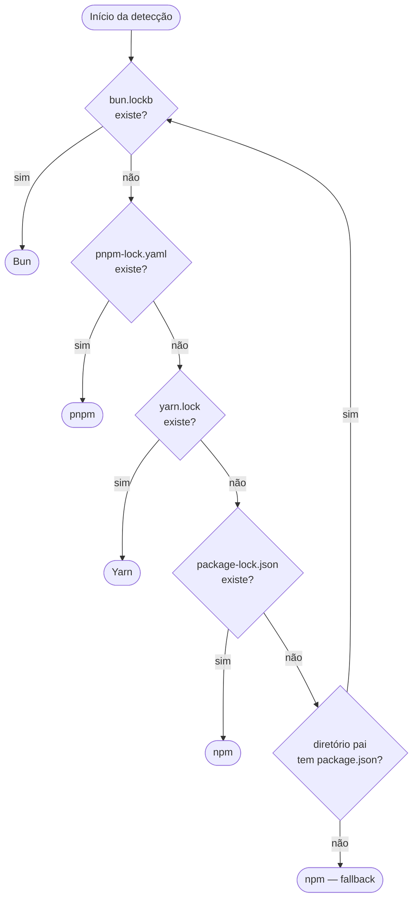
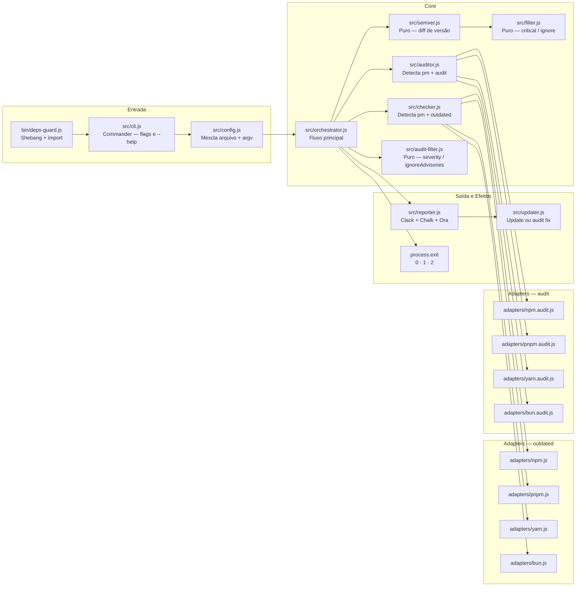
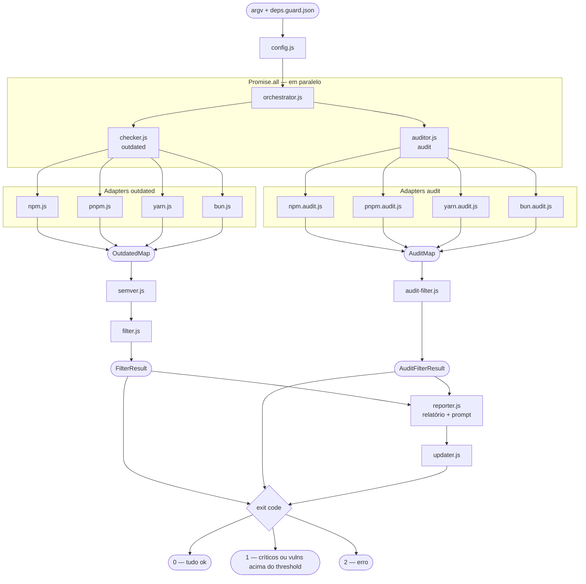

# deps-guard

> Bloqueie dependências desatualizadas e vulnerabilidades antes que elas rodem no seu projeto.

`deps-guard` é uma ferramenta de CLI projetada para rodar como um hook `pre*` do npm. Ela verifica se suas dependências estão atualizadas e, opcionalmente, escaneia por vulnerabilidades conhecidas (CVEs/GHSA) — bloqueando a execução quando necessário e oferecendo interativamente corrigir os problemas encontrados.

```bash
npx deps-guard --critical react,next,typescript --ignore zod
npx deps-guard --audit --audit-level high
```

---

## Índice

- [Por que usar](#por-que-usar)
- [Instalação](#instalação)
- [Uso](#uso)
  - [Como hook pre-script](#como-hook-pre-script)
  - [Arquivo de configuração](#arquivo-de-configuração)
  - [Flags da CLI](#flags-da-cli)
  - [Modo CI](#modo-ci)
- [Verificação de vulnerabilidades](#verificação-de-vulnerabilidades)
- [Exit codes](#exit-codes)
- [Suporte a package managers](#suporte-a-package-managers)
- [Decisões de UX](#decisões-de-ux)
- [Arquitetura](#arquitetura)
  - [Estrutura de arquivos](#estrutura-de-arquivos)
  - [Responsabilidades dos módulos](#responsabilidades-dos-módulos)
  - [Fluxo de dados](#fluxo-de-dados)
- [Contribuindo](#contribuindo)

---

## Por que usar

Você já roda linters, checagem de tipos e testes antes de fazer deploy. Mas nada te avisa quando você está desenvolvendo com uma versão desatualizada do React, Next.js ou com uma dependência que tem uma vulnerabilidade crítica conhecida.

O `deps-guard` preenche essa lacuna. Adicione-o em um hook `predev` ou `prebuild` e ele vai:

1. Detectar seu package manager automaticamente
2. Verificar dependências desatualizadas
3. Opcionalmente escanear por vulnerabilidades conhecidas (CVEs/GHSA)
4. Exibir um relatório claro agrupado por severidade
5. Em sessões interativas, oferecer atualizar ou corrigir na hora
6. Sair com o exit code correto para que seu script continue ou seja abortado

Nenhuma configuração necessária para começar. Controle total quando você quiser.

---

## Instalação

```bash
# npm
npm install --save-dev deps-guard

# pnpm
pnpm add -D deps-guard

# yarn
yarn add -D deps-guard

# bun
bun add -d deps-guard
```

---

## Uso

### Como hook pre-script

Adicione o `deps-guard` como script `pre*` no seu `package.json`. npm, pnpm, yarn e bun executam hooks `pre*` automaticamente antes do script correspondente.

```json
{
  "scripts": {
    "predev": "deps-guard --critical react,next,typescript --ignore zod",
    "dev": "next dev",

    "prebuild": "deps-guard --ci --audit",
    "build": "next build"
  }
}
```

Quando o `deps-guard` sai com código `1`, o package manager aborta a execução e `dev` / `build` nunca roda.

### Arquivo de configuração

Em vez de (ou além de) flags de CLI, crie um `deps.guard.json` na raiz do seu projeto:

```json
{
  "$schema": "https://unpkg.com/deps-guard/schemas/deps.guard.schema.json",
  "critical": ["react", "react-dom", "next", "typescript"],
  "ignore": ["zod", "eslint"],
  "failOn": "critical",
  "updateType": "patch",
  "audit": true,
  "auditLevel": "high",
  "ignoreAdvisories": ["GHSA-jf85-cpcp-j695"],
  "auditFailOn": "critical"
}
```

O campo `$schema` ativa autocomplete e validação em VS Code, WebStorm, Zed e qualquer editor com suporte a JSON Schema — sem instalar nenhuma extensão.

Flags de CLI têm precedência sobre o arquivo de configuração.

**Todas as opções de configuração:**

| Chave              | Tipo                                                            | Padrão       | Descrição                                                |
| ------------------ | --------------------------------------------------------------- | ------------ | -------------------------------------------------------- |
| `critical`         | `string[]`                                                      | `[]`         | Pacotes que disparam exit code `1` quando desatualizados |
| `ignore`           | `string[]`                                                      | `[]`         | Pacotes ignorados silenciosamente no relatório           |
| `failOn`           | `"critical"` \| `"any"` \| `"never"`                            | `"critical"` | Quando sair com código `1` por pacotes desatualizados    |
| `updateType`       | `"major"` \| `"minor"` \| `"patch"`                             | `"patch"`    | Tipo mínimo de atualização a reportar                    |
| `audit`            | `boolean`                                                       | `false`      | Ativa verificação de vulnerabilidades                    |
| `auditLevel`       | `"info"` \| `"low"` \| `"moderate"` \| `"high"` \| `"critical"` | `"high"`     | Severidade mínima a reportar                             |
| `ignoreAdvisories` | `string[]`                                                      | `[]`         | GHSA IDs ou CVE IDs a ignorar                            |
| `auditFailOn`      | mesmo enum de `auditLevel` \| `"never"`                         | `"critical"` | Quando sair com código `1` por vulnerabilidades          |

### Flags da CLI

| Flag                        | Alias | Descrição                                                        |
| --------------------------- | ----- | ---------------------------------------------------------------- |
| `--critical <pkgs>`         | `-c`  | Lista separada por vírgulas de pacotes críticos                  |
| `--ignore <pkgs>`           | `-i`  | Lista separada por vírgulas de pacotes a ignorar                 |
| `--fail-on <level>`         |       | `critical` (padrão), `any` ou `never`                            |
| `--update-type <type>`      |       | Tipo mínimo a reportar: `major`, `minor`, `patch`                |
| `--audit`                   |       | Ativa verificação de vulnerabilidades                            |
| `--audit-level <level>`     |       | Severidade mínima: `info`, `low`, `moderate`, `high`, `critical` |
| `--ignore-advisories <ids>` |       | IDs separados por vírgula (GHSA ou CVE)                          |
| `--audit-fail-on <level>`   |       | Quando sair com `1` por vulns (mesmos valores + `never`)         |
| `--ci`                      |       | Modo não-interativo, sem prompts                                 |
| `--json`                    |       | Imprime o relatório como JSON no stdout                          |
| `--no-update`               |       | Não oferece atualizar, apenas reporta                            |
| `--version`                 | `-v`  | Exibe a versão                                                   |
| `--help`                    | `-h`  | Exibe a ajuda                                                    |

### Modo CI

Em ambientes de CI, prompts interativos são desativados automaticamente quando a variável de ambiente `CI` está definida (padrão no GitHub Actions, CircleCI, Vercel, etc.).

```bash
deps-guard --ci --audit
```

No modo CI, o `deps-guard` imprime o relatório e sai com o código apropriado. Nunca faz prompts e nunca roda atualizações.

---

## Verificação de vulnerabilidades

A verificação de vulnerabilidades é **opt-in** (`audit: false` por padrão) porque ela faz uma requisição de rede ao registry e pode adicionar 3–8 segundos ao tempo de inicialização — o que seria incômodo em todo `predev`.

Ative quando fizer sentido para o seu fluxo:

```json
{
  "audit": true,
  "auditLevel": "high",
  "auditFailOn": "critical"
}
```

Quando ativo, o `deps-guard` roda `outdated` e `audit` em paralelo, então o custo extra é apenas o tempo da requisição de rede, não a soma dos dois.

### Como funciona o audit



### Ignorando advisories específicos

Quando uma vulnerabilidade não tem fix disponível ou não afeta seu caso de uso, você pode ignorá-la pelo ID:

```json
{
  "ignoreAdvisories": ["GHSA-jf85-cpcp-j695", "CVE-2023-45133"]
}
```

A comparação é case-insensitive. O advisory continua aparecendo como "ignorado" no relatório para que a decisão seja rastreável.

### Limitações por package manager

| Manager      | Suporte     | Observações                                                      |
| ------------ | ----------- | ---------------------------------------------------------------- |
| npm          | ✅ Completo | `npm audit --json` desde v7; formato estável                     |
| pnpm         | ✅ Completo | Mesmo formato do npm; suporta monorepos nativamente              |
| yarn classic | ✅ Completo | NDJSON com `type: "auditAdvisory"`                               |
| yarn berry   | ✅ Completo | `yarn npm audit --json`; formato compatível com npm v7           |
| bun          | ⚠️ Parcial  | `bun audit` ainda não tem `--json`; parsing best-effort do texto |

---

## Exit codes

| Código | Significado                                                                            |
| ------ | -------------------------------------------------------------------------------------- |
| `0`    | Tudo ok — nenhum critério de falha atingido                                            |
| `1`    | Dependências críticas desatualizadas **e/ou** vulnerabilidades acima do threshold      |
| `2`    | Erro inesperado (`node_modules` ausente, falha de rede, package manager não suportado) |

Os dois critérios (`failOn` para versões e `auditFailOn` para vulnerabilidades) são independentes e combinados com `OR`: basta um deles ser atingido para o exit code ser `1`.

Em modo interativo, escolher "Ignorar por agora" sempre resulta em exit `0` — o usuário foi consultado e decidiu conscientemente continuar.

---

## Suporte a package managers

O `deps-guard` detecta seu package manager automaticamente procurando por arquivos de lock:



A detecção percorre a árvore de diretórios a partir do `cwd`. Dois níveis consecutivos sem `package.json` ou `node_modules` encerram a busca — o que evita vazar para fora do workspace sem bloquear monorepos com diretórios intermediários (ex: `packages/web/` → `packages/` → `root/`).

| Manager      | Outdated                         | Audit                            |
| ------------ | -------------------------------- | -------------------------------- |
| npm          | `npm outdated --json`            | `npm audit --json`               |
| pnpm         | `pnpm -r outdated --format json` | `pnpm audit --json`              |
| yarn classic | `yarn outdated --json`           | `yarn audit --json`              |
| yarn berry   | via `npm info` por dep           | `yarn npm audit --json`          |
| bun          | `bun outdated` (tabela)          | `bun audit` (texto, best-effort) |

---

## Decisões de UX

### Commander para flags, Clack para o prompt interativo

[Commander.js](https://github.com/tj/commander.js) cuida do parsing de flags e produz saída padrão de `--help`. [Clack](https://github.com/natemoo-re/clack) cuida da sessão interativa — o menu de escolha após o relatório. Os dois são complementares: Commander é dono do contrato (quais flags existem), Clack é dono da experiência (como a sessão parece no terminal).

### Chalk para cores, não ANSI bruto

O script original usava códigos de escape ANSI brutos (`\x1b[31m`). [Chalk](https://github.com/chalk/chalk) detecta capacidades do terminal, aplica `NO_COLOR` e `FORCE_COLOR` automaticamente e lida com `--color`/`--no-color`. O comportamento é o mesmo; a compatibilidade é muito maior.

### Ora para o spinner de carregamento

Rodar `outdated` + `audit` pode levar vários segundos em projetos grandes. Sem feedback, usuários assumem que o processo travou. [Ora](https://github.com/sindresorhus/ora) adiciona um spinner durante a verificação e limpa adequadamente quando termina.

### Audit e outdated em paralelo

Quando `audit: true`, ambos os checks rodam via `Promise.all`. O custo extra é apenas o tempo de rede do audit, não a soma dos dois tempos.

### Audit é opt-in

O audit faz requisição de rede e pode adicionar 3–8 segundos. Em projetos que rodam `predev` com frequência durante o desenvolvimento, isso seria incômodo. O padrão é `false` — o usuário opt-in explicitamente quando quiser.

### "Ignorar" sempre sai com exit 0

Em modo interativo, escolher "Ignorar por agora" resulta em exit `0`. O exit `1` só faz sentido em modo CI/`--no-update`, onde o usuário não foi consultado. Quando o usuário vê o relatório e decide conscientemente continuar, ele assumiu a responsabilidade.

### Agrupamento por severidade

Pacotes desatualizados são agrupados em MAJOR / MINOR / PATCH; vulnerabilidades em CRITICAL / HIGH / MODERATE / LOW / INFO. Pacotes críticos (da sua configuração) e vulnerabilidades críticas sempre aparecem primeiro.

### Saída JSON para tooling

`--json` imprime um relatório estruturado com ambas as seções (`deps` e `audit`) para integração com dashboards, Slack, ou pipelines de notificação.

---

## Arquitetura

### Estrutura de arquivos

```
deps-guard/
├── bin/
│   └── deps-guard.js          # Entry point com shebang
├── src/
│   ├── cli.js                 # Commander — flags e --help
│   ├── config.js              # Mescla deps.guard.json com argv
│   ├── orchestrator.js        # Fluxo principal (único que chama process.exit)
│   ├── checker.js             # Detecta pm, delega ao adapter de outdated
│   ├── auditor.js             # Detecta pm, delega ao adapter de audit
│   ├── semver.js              # Puro: compara versões, retorna major/minor/patch/none
│   ├── filter.js              # Puro: aplica regras critical/ignore em outdated
│   ├── audit-filter.js        # Puro: filtra vulns por severidade e ignoreAdvisories
│   ├── reporter.js            # Toda a saída no terminal: Clack, Chalk, Ora
│   ├── updater.js             # Executa update ou audit fix
│   ├── index.js               # API pública para uso programático
│   └── adapters/
│       ├── npm.js             # npm outdated --json → OutdatedMap
│       ├── pnpm.js            # pnpm -r outdated --format json → OutdatedMap
│       ├── yarn.js            # yarn outdated --json → OutdatedMap
│       ├── bun.js             # bun outdated (tabela) → OutdatedMap
│       ├── npm.audit.js       # npm audit --json → AuditMap
│       ├── pnpm.audit.js      # pnpm audit --json → AuditMap
│       ├── yarn.audit.js      # yarn audit --json (classic + berry) → AuditMap
│       └── bun.audit.js       # bun audit (texto) → AuditMap
├── test/
│   ├── semver.test.js
│   ├── filter.test.js
│   ├── audit-filter.test.js
│   ├── adapters.test.js
│   ├── audit-adapters.test.js
│   ├── config.test.js
│   └── checker.test.js
├── schemas/
│   ├── deps.guard.schema.json         # JSON Schema para deps.guard.json
│   └── schemastore-catalog-entry.json # Entrada para submissão ao SchemaStore
├── deps.guard.json            # Config de exemplo (usada pelo próprio repo)
└── package.json
```

### Responsabilidades dos módulos



### Fluxo de dados



### Por que os módulos puros importam

`semver.js`, `filter.js` e `audit-filter.js` são mantidos estritamente puros (sem I/O, sem efeitos colaterais) para que possam ser testados unitariamente sem mockar o sistema de arquivos ou spawnar processos. O restante da complexidade — execução de comandos, saída no terminal, interação com o usuário — fica isolado em módulos mais fáceis de testar por integração ou manualmente.

Essa fronteira também significa que suportar um novo package manager exige apenas um novo arquivo de adapter. A lógica central não muda.

### Schema e DX

O arquivo `schemas/deps.guard.schema.json` é publicado junto com o package via npm e acessível em:

```
https://unpkg.com/deps-guard/schemas/deps.guard.schema.json
```

Adicionando `"$schema"` ao `deps.guard.json`, editores com suporte a JSON Schema ativam autocomplete e validação automaticamente. Após o primeiro `npm publish`, o schema pode ser submetido ao [SchemaStore](https://github.com/SchemaStore/schemastore) — após o merge, a detecção torna-se automática pelo nome do arquivo, sem precisar do campo `$schema`.

---

## Contribuindo

```bash
git clone https://github.com/você/deps-guard
cd deps-guard
pnpm install
node bin/deps-guard.js --help
```

Para testar em um projeto real:

```bash
# No diretório do deps-guard
pnpm link

# No projeto alvo
pnpm link deps-guard
```

**Rodando os testes:**

```bash
pnpm test
```

A suite cobre 125 casos distribuídos em 7 arquivos, todos usando o test runner nativo do Node.js (sem dependências externas de teste):

| Arquivo                  | O que cobre                                                                      |
| ------------------------ | -------------------------------------------------------------------------------- |
| `semver.test.js`         | `parseVersion`, `getUpdateType`, `isOutdated`, `meetsThreshold`                  |
| `filter.test.js`         | Classificação critical/regular/ignored, threshold, counts, exit code             |
| `audit-filter.test.js`   | Classificação por severidade, ignoreAdvisories, shouldAuditFail, groupBySeverity |
| `adapters.test.js`       | Parsing de npm, pnpm, bun e yarn classic para OutdatedMap                        |
| `audit-adapters.test.js` | Parsing de npm, pnpm, yarn classic e bun para AuditMap                           |
| `config.test.js`         | Defaults, leitura de arquivo, merge com argv, detecção de CI, opções de audit    |
| `checker.test.js`        | Detecção de lock file, prioridade entre managers, monorepo, fallback             |
